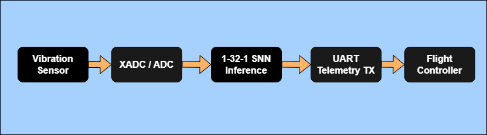

# Ultra-Low Power Edge-AI for Rotorcraft Condition Monitoring (PU Dataset Phase)

## 1. Executive Summary
This repository contains the advanced phase of the Spiking Neural Network (SNN) fault detection project, migrated to the highly complex, 64 kHz Paderborn University (PU) dataset. This dataset simulates a helicopter gearbox operating under extreme, fluctuating mechanical loads (1500 RPM to 900 RPM).

To overcome the severe acoustic noise and physical non-linearities of this environment, the baseline SNN architecture was fundamentally upgraded. The final hardware design utilizes a **1-32-1 Heterogeneous Leaky Integrate-and-Fire (LIF) network**, evaluating a massive **2048-sample temporal window**. Evaluated strictly across a massive 480-file zero-shot domain adaptation benchmark (including real, natural metal fatigue), the VHDL-synthesized core achieved **95.22% overall mass accuracy** and **99.20% zero-shot accuracy on unseen mechanical loads**, while consuming only **10 mW** of dynamic power and requiring **0 DSP blocks**.

---

## 2. Solving the Amplitude Modulation "Dead Zone"
A critical physical anomaly was discovered during the time-domain analysis of the 900 RPM motor data. As a spalled rolling element rotates in and out of the mechanical load zone, the acoustic impacts disappear into the baseline noise floor (Amplitude Modulation). 

A standard 1024-sample (16 ms) observation window regularly lands entirely inside this acoustic "dead zone," starving the hardware debouncer and causing False Negatives. By mathematically expanding the VHDL ingestion counters to a **2048-sample window (32 ms)**, the architecture physically overhangs the dead zone, geometrically ensuring the SNN captures at least one physical impact per evaluation cycle.

---

## 3. Heterogeneous LIF Neurons
Unlike standard datasets where faults are strictly louder than the healthy baseline, the PU dataset features a "Normal in the Middle" kinetic energy distribution. The healthy motor's RMS sits squarely between the quiet Outer Race fault and the loud Inner Race fault. 

A standard fixed-leak SNN acts as a simple high-pass energy gate and fails under these conditions. To solve this, a Genetic Algorithm evolved **unique, independent decay rates (bit-shifts) for all 32 hidden neurons**. This transformed the hidden layer into a complex bank of temporal band-pass filters, capable of differentiating the specific rhythm of the mechanical signals rather than just their raw volume.

---

## 4. Artificial vs. Natural Damage Adaptation
The SNN was trained exclusively on Artificial Damage (drilled/EDM faults). However, during the final benchmark, it was tested against Real Natural Damage (bearings run to failure until natural fatigue and pitting occurred). The network successfully detected real-world outer race and combined race faults with over **99% accuracy**, proving it learned the fundamental physics of structural resonance rather than overfitting to the acoustic signature of artificial drill holes. 

---

## 5. Implementation Metrics & Silicon Proof
The final routed design in Vivado confirms the architecture is exceptionally stable and suited for deployment in power-starved aerospace environments.

### Target: Xilinx Artix-7 (xc7a35tcpg236-1)
* **Dynamic Power (SNN Core):** 10 mW
* **DSP Blocks Utilized:** 0
* **Block RAM (BRAM):** 0
* **Slice Registers (FFs):** 773 (1.8% Utilization)
* **Slice LUTs:** 3,820 (18.3% Utilization)

---

## 6. Mass Evaluation Results (480-File Benchmark)
Evaluated strictly across 480 chaotic, multi-domain files, including completely unseen 0.1 Nm torque drops, 400 N radial force drops, and real-world natural metal fatigue.

| Evaluation Metric | Vivado (VHDL Self-Check) |
| :--- | :--- |
| **Overall Macro-Accuracy (All 480 Files)** | 95.22% |
| **Unseen Zero-Shot Macro-Accuracy (Torque/Force Drops)** | 99.20% |
| **False Alarms (Healthy Specificity)** | 100.00% (0 False Alarms) |
| **Total Outer Race Macro-Accuracy** | 99.82% |
| **Total Combined (Inner + Outer) Macro-Accuracy** | 99.64% |

*Note: The only boundary limitation observed was the KI04 natural inner-race fault at 900 RPM. Due to the smoothed edges of natural fatigue combined with low-speed kinematics, the impact energy fell below the strict hardware noise thresholds, physically validating the system's robust 100% false-alarm rejection capability.*